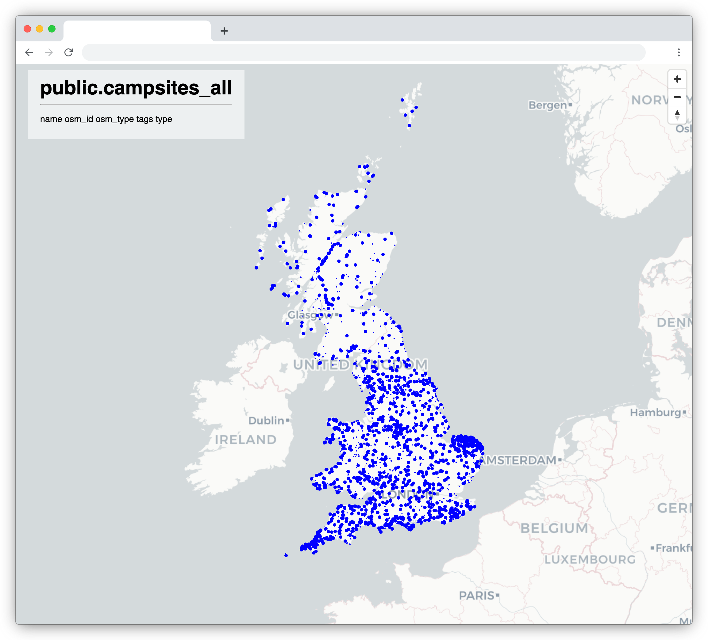

# world-server

Tools and scripts to host your own postgis database and tile server using [OpenStreetMap](https://www.openstreetmap.org/) data.

This repository contains:

* A docker compose application featuring:
  * [PostGIS](https://postgis.net/) - a postgres database with geographical capabilities
  * [pg_tileserv](https://github.com/CrunchyData/pg_tileserv) - a tile server with a simple map interface
* A number of scripts to:
  * fetch data from [OSM](https://www.openstreetmap.org/),
  * import data into the PostGIS database, and
  * run the tile server

_NB. By default, the scripts in this repository will build a database of campsites in the UK._

## Prerequisites

- The scripts included here assume presence of `bash`, [Homebrew](https://brew.sh/), and [Docker](https://www.docker.com/products/docker-desktop/) on Mac OS.
- `import-data.sh` uses `brew` to install [osm2pgsql](https://osm2pgsql.org/)

## Scripts

| script               | purpose                                                                                                                       |
| -------------------- | ----------------------------------------------------------------------------------------------------------------------------- |
| `update-data.sh`     | Retrieves fresh data from [Geofabrik](http://download.geofabrik.de/europe/great-britain.html)                                 |
| `run-server.sh`      | Launches a [PostGIS](https://postgis.net/) database and [pg_tileserv](https://github.com/CrunchyData/pg_tileserv) tile server |
| `import-data.sh`     | Imports data into the database, using [osm2pgsql](https://osm2pgsql.org/) and a custom lua script                             |
| `open-tileserver.sh` | Opens a browser to the tileserver (on localhost)                                                                              |

_NB. `update-data.sh` is currently untested._

## Getting started

Follow these steps to build a world server that contains details of all campsites in the UK known to OpenStreetMap.

- Run `update-data.sh` to fetch a fresh copy of `data/great-britain-latest.osm.pbf`
- Run `run-server.sh` to start the database and tile server
- Run `import-data.sh` to import all campsites into the database
- Run `open-tileserver.sh` to visit the tile server, or visit: [http://localhost:7800](http://localhost:7800)

### Import times

Please submit additional data to help establish some import expectations...

| data file                             | options                                 | system               | import time |
| ------------------------------------- | --------------------------------------- | -------------------- | ----------- |
| `--data great-britain-latest.osm.pbf` | `--all`                                 | Macbook Pro M1, 2020 | `1:00:51`   |
| `--data great-britain-latest.osm.pbf` | `--script scripts/import-campsites.lua` | Macbook Pro M1, 2020 | `0:00:39`   |

## Customisation

### Use different OSM data

- Find another `.osm.pbf` data source from [Geofabrik](http://download.geofabrik.de)
- Modify `update-data.sh` to retrieve this data source instead
- Provide the `--data` option to `import-data.sh` and point to the new data source

### Import different data

- Modify the provided script `scripts/import-campsites.lua` or create your own
- Provide the `--script` option to `import-data.sh` and point to your chosen script

There are plenty of lua examples at: https://github.com/openstreetmap/osm2pgsql/tree/master/flex-config

## Security

_This application is assumed to be running on your personal machine and exposed, at most, to your local home network. In order to use it in any other context, you will need to take some precautionary steps..._

**The database password is published in this repository.** This means it is not safe. Do not use this password in production. Modify the values found in: `config/word-server.env` and do not commit these values to your repository if public.

**The tile server runs over HTTP by default.** Do not expose this tile server to the internet! Put it behind [NGINX](https://www.nginx.com/) or another suitable proxy. It is also possible to [configure](https://github.com/CrunchyData/pg_tileserv#configuration-file) `pg_tileserv` to support SSL certificates.
